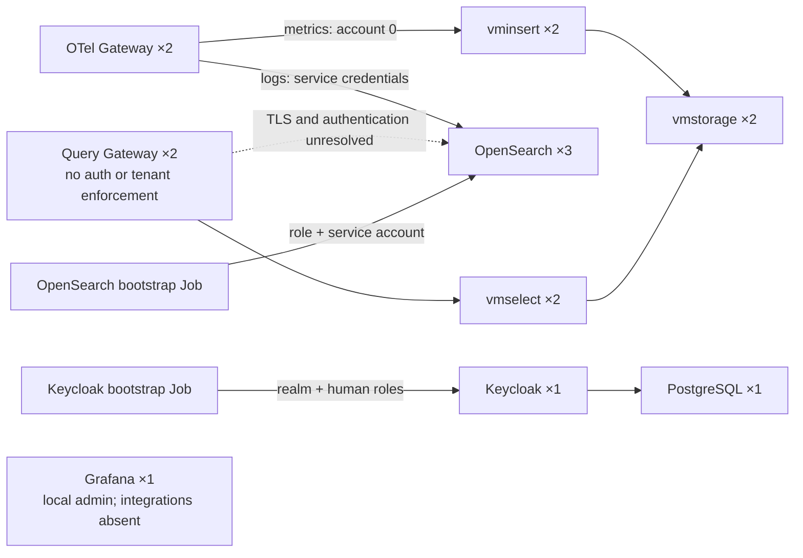

# Repository audit

**Safe to deploy as-is? NO.** The Kubernetes wiring is largely consistent, but the image reference, bootstrap reliability, and several runtime assumptions need attention. The current implementation also cannot enforce tenant isolation.

I made **no repository changes and no cluster calls**.

## Validation results

| Check | Result |
|---|---|
| Development Kustomize render | **Pass: 29 resources** |
| Duplicate resources, Secret keys, ConfigMap mounts, PVC references, Service selectors and named ports | **No inconsistencies found** |
| Production overlay | Renders **only the namespace** |
| TypeScript compilation | **Pass**, including compilation performed entirely in memory |
| Local application startup and `/health` | **Pass** |
| End-to-end tests | **Fail before executing tests** |
| Read-only lint check | **13 errors**, mostly formatting |
| Local proxy/bootstrap reproductions | Confirmed defects described below |

These checks do not establish whether the managed cluster permits privileged containers, how its CSI driver formats volumes, or whether it can pull every image.

## 1. Deployment and bootstrap problems

### 1. Query Gateway image cannot support the intended remote deployment

**BLOCKER · definite error**

**File:** [Query Gateway deployment, line 23](C:/Users/lelovo/Desktop/multi-tenant-cloud-observability/kubernetes/base/query/query-gateway/deployment.yaml:23)

`query-gateway:latest` is still a placeholder. It does not identify your application in a registry accessible to the remote cluster.

**Impact:** The gateway cannot reliably start in Kubernetes.

**Minimal recommendation:** Build and publish the image, then reference its registry-qualified, immutable version in the development overlay. Configure registry credentials if required.

### 2. OpenSearch bootstrap can report success after every operation fails

**HIGH · definite error**

**File:** [OpenSearch bootstrap, line 46](C:/Users/lelovo/Desktop/multi-tenant-cloud-observability/kubernetes/base/storage/opensearch/bootstrap/job.yaml:46)

Every request uses `curl -ks` without HTTP failure checking. HTTP `401`, `403`, and `503` responses normally still produce a successful curl exit code.

Consequently:

- The wait loop can finish before authenticated OpenSearch access works.
- Role and user creation can fail while the Job reports success.
- Collector authentication then fails because its service account was never provisioned.

**Confirmed locally:** With simulated `401` responses for every request, the actual script printed `OpenSearch bootstrap complete.` and exited `0`.

**Minimal recommendation:** Fail on unsuccessful HTTP responses, add request timeouts, and verify the created identity and role before reporting completion.

### 3. PostgreSQL may fail to initialize on a newly provisioned volume

**HIGH · likely runtime issue**

**File:** [PostgreSQL StatefulSet, line 47](C:/Users/lelovo/Desktop/multi-tenant-cloud-observability/kubernetes/base/identity/keycloak/postgres/statefulset.yaml:47)

The PVC mounts directly at PostgreSQL 17’s default data directory, with no separate `PGDATA` subdirectory. A filesystem containing `lost+found` makes that directory nonempty, which causes `initdb` to reject it.

**Impact:** PostgreSQL fails; Keycloak consequently cannot become ready.

This depends on the CSI volume’s actual filesystem. PostgreSQL explicitly recommends a subdirectory for this situation. [PostgreSQL initialization source](https://github.com/postgres/postgres/blob/REL_17_STABLE/src/bin/initdb/initdb.c#L2852)

**Minimal recommendation:** Keep the mount and set `PGDATA=/var/lib/postgresql/data/pgdata` before the first initialization.

### 4. OpenSearch startup depends on permission to run a privileged container

**HIGH · likely runtime issue**

**File:** [OpenSearch StatefulSet, line 26](C:/Users/lelovo/Desktop/multi-tenant-cloud-observability/kubernetes/base/storage/opensearch/statefulset.yaml:26)

The init container requires `privileged: true` to change a node-level setting. Kubernetes Baseline and Restricted Pod Security policies reject privileged containers. The repository cannot establish which admission policy the provider applies. [Kubernetes Pod Security Standards](https://kubernetes.io/docs/concepts/security/pod-security-standards/)

**Impact:** If admission rejects the init container, none of the OpenSearch pods can start—even if the node already has a sufficient setting.

**Minimal recommendation:** Confirm provider support before applying. If privileged workloads are prohibited, configure `vm.max_map_count` through the provider’s node configuration and remove the init container. An ordinary pod-level sysctl setting is not an equivalent replacement. [Kubernetes sysctl documentation](https://kubernetes.io/docs/tasks/administer-cluster/sysctl-cluster/)

## 2. Query and ingestion problems

### 5. Query Gateway has neither the TLS configuration nor credentials needed for OpenSearch

**HIGH · definite error**

**Files:** [Proxy service, line 19](C:/Users/lelovo/Desktop/multi-tenant-cloud-observability/services/query-gateway/src/proxy/http-proxy.service.ts:19), [gateway environment, line 36](C:/Users/lelovo/Desktop/multi-tenant-cloud-observability/kubernetes/base/query/query-gateway/deployment.yaml:36)

The gateway targets HTTPS OpenSearch with demo certificates, but supplies no trusted CA or backend TLS configuration. It also supplies no backend credentials and discards incoming `Authorization`.

**Impact:** OpenSearch queries encounter certificate validation failure; resolving that alone still leaves authentication unresolved. `/health` continues returning success.

**Minimal recommendation:** Configure backend certificate trust and an explicit query identity/authentication mechanism. That mechanism must support the intended DLS isolation; a shared unrestricted account would not establish tenant isolation.

### 6. The query plane exposes arbitrary backend operations and tenant paths

**HIGH · definite error**

**Files:** [VictoriaMetrics controller, line 14](C:/Users/lelovo/Desktop/multi-tenant-cloud-observability/services/query-gateway/src/proxy/victoriametrics.controller.ts:14), [OpenSearch controller, line 14](C:/Users/lelovo/Desktop/multi-tenant-cloud-observability/services/query-gateway/src/proxy/opensearch.controller.ts:14), [AuthModule](C:/Users/lelovo/Desktop/multi-tenant-cloud-observability/services/query-gateway/src/auth/auth.module.ts:3)

Both controllers accept every HTTP method and forward caller-controlled paths without authorization.

**Confirmed against a local mock:**

- Requests selecting arbitrary VictoriaMetrics account IDs passed through unauthenticated.
- VictoriaMetrics deletion paths passed through.
- OpenSearch `DELETE` requests passed through.

VictoriaMetrics actually exposes its deletion API through `vmselect`; this is not solely a hypothetical future OpenSearch credential issue. [VictoriaMetrics API documentation](https://docs.victoriametrics.com/victoriametrics/cluster-victoriametrics/)

**Minimal recommendation:** Restrict backend operations explicitly, then construct tenant paths from validated identity and the tenant registry. Authentication alone does not make unrestricted forwarding safe.

### 7. OpenSearch multi-search request bodies are lost

**HIGH · definite error**

**Files:** [Application startup, line 7](C:/Users/lelovo/Desktop/multi-tenant-cloud-observability/services/query-gateway/src/main.ts:7), [proxy request body, line 23](C:/Users/lelovo/Desktop/multi-tenant-cloud-observability/services/query-gateway/src/proxy/http-proxy.service.ts:23)

The application forwards `req.body`, but its default body parsers do not parse `application/x-ndjson`.

**Confirmed locally:** A nonempty NDJSON request to `/_msearch` reached the downstream mock with an **empty body**.

**Impact:** OpenSearch multi-search queries using NDJSON fail, including relevant Grafana query flows.

**Minimal recommendation:** Preserve raw request bytes for the supported proxy content types, with appropriate size limits.

### 8. Proxy requests have no timeout or bounded response buffering

**MEDIUM · likely runtime issue**

**File:** [Proxy service, line 19](C:/Users/lelovo/Desktop/multi-tenant-cloud-observability/services/query-gateway/src/proxy/http-proxy.service.ts:19)

The HTTP client has no configured timeout; the installed Axios default is `0`. Responses are fully buffered with `arraybuffer`, and network failures have no gateway-specific error handling.

**Impact:** Stalled backends can retain requests indefinitely. Large or concurrent responses can exhaust the gateway’s 512 MiB memory limit. Connection failures surface as generic application errors.

**Minimal recommendation:** Set deadlines, bound or stream responses, propagate cancellation, and translate backend failures into useful `502`/`504` responses.

### 9. Prefix removal disagrees with route matching

**MEDIUM · definite error**

**File:** [Proxy service, line 16](C:/Users/lelovo/Desktop/multi-tenant-cloud-observability/services/query-gateway/src/proxy/http-proxy.service.ts:16)

Routing accepts differently cased paths, but `replace(prefix, '')` is case-sensitive.

**Confirmed locally:** `/QUERY/opensearch/otel-logs/_search` was accepted but forwarded with the gateway prefix still attached.

**Minimal recommendation:** Derive the downstream path from matched route parameters, or enforce consistent case-sensitive routing.

### 10. Tenant enforcement remains absent on both planes

**HIGH · architectural concern — acknowledged unfinished work**

**Files:** [Collector configuration](C:/Users/lelovo/Desktop/multi-tenant-cloud-observability/kubernetes/base/ingest/otel-gateway/config/collector.yaml:1), [TenantModule](C:/Users/lelovo/Desktop/multi-tenant-cloud-observability/services/query-gateway/src/tenant/tenant.module.ts:3), [Keycloak bootstrap](C:/Users/lelovo/Desktop/multi-tenant-cloud-observability/kubernetes/base/identity/keycloak/bootstrap/job.yaml:53)

Currently:

- Ingestion has no client authentication or `telemetry.write` enforcement.
- All metrics enter account `0`.
- No trusted canonical tenant enrichment exists.
- No UUID-to-VictoriaMetrics registry exists.
- OpenSearch query DLS is not configured.
- Keycloak creates the realm and human roles, but not the application integration.

**Impact:** The current baseline cannot meet the primary multi-tenant requirements.

**Minimal recommendation:** Complete these as server-side capabilities before connecting tenant clients. A persistent tenant registry and provisioning workflow belong in application/service logic; per-tenant Kustomize entries would be awkward and contrary to the generic platform design.

## 3. Operational and repository issues

| # | Severity · status | Exact location | Problem, impact, and minimal recommendation |
|---|---|---|---|
| 11 | **MEDIUM · definite error** | [OpenSearch bootstrap:85](C:/Users/lelovo/Desktop/multi-tenant-cloud-observability/kubernetes/base/storage/opensearch/bootstrap/job.yaml:85) | The password is interpolated directly into JSON. Quotes or backslashes can corrupt the payload or change the password representation. **Use proper JSON serialization.** The current local password did not trigger this condition. |
| 12 | **MEDIUM · likely runtime issue** | [OpenSearch Job:6](C:/Users/lelovo/Desktop/multi-tenant-cloud-observability/kubernetes/base/storage/opensearch/bootstrap/job.yaml:6), [Keycloak Job:6](C:/Users/lelovo/Desktop/multi-tenant-cloud-observability/kubernetes/base/identity/keycloak/bootstrap/job.yaml:6) | Wait loops have no overall deadline, and Jobs have no resource requests/limits. Repeated unsuccessful waiting does not consume `backoffLimit` while the process remains alive. **Add bounded waiting and resource budgets.** |
| 13 | **MEDIUM · likely runtime issue** | [development Secret generators:14](C:/Users/lelovo/Desktop/multi-tenant-cloud-observability/kubernetes/overlays/development/kustomization.yaml:14), [OpenSearch Job:9](C:/Users/lelovo/Desktop/multi-tenant-cloud-observability/kubernetes/base/storage/opensearch/bootstrap/job.yaml:9), [Keycloak Job:9](C:/Users/lelovo/Desktop/multi-tenant-cloud-observability/kubernetes/base/identity/keycloak/bootstrap/job.yaml:9) | Secret changes alter generated names inside fixed-name Job templates. Subsequent apply encounters immutable Job-template changes; unchanged completed Jobs also do not rerun. **Define an explicit bootstrap rerun and credential-rotation procedure.** Changing initialization Secrets alone does not necessarily change credentials already stored by the applications. |
| 14 | **MEDIUM · likely runtime issue** | [Collector deployment:19](C:/Users/lelovo/Desktop/multi-tenant-cloud-observability/kubernetes/base/ingest/otel-gateway/deployment.yaml:19), [PostgreSQL:20](C:/Users/lelovo/Desktop/multi-tenant-cloud-observability/kubernetes/base/identity/keycloak/postgres/statefulset.yaml:20), [vminsert:20](C:/Users/lelovo/Desktop/multi-tenant-cloud-observability/kubernetes/base/storage/victoriametrics/vminsert/deployment.yaml:20), [vmselect:20](C:/Users/lelovo/Desktop/multi-tenant-cloud-observability/kubernetes/base/storage/victoriametrics/vmselect/deployment.yaml:20), [vmstorage:21](C:/Users/lelovo/Desktop/multi-tenant-cloud-observability/kubernetes/base/storage/victoriametrics/vmstorage/statefulset.yaml:21), [OpenSearch probe:96](C:/Users/lelovo/Desktop/multi-tenant-cloud-observability/kubernetes/base/storage/opensearch/statefulset.yaml:96) | Several services have no readiness probes; OpenSearch checks only an open TCP port. Pods can appear ready before their service works. **Add component-appropriate startup/readiness checks and selective liveness checks.** Avoid making liveness depend on another service’s availability. |
| 15 | **MEDIUM · likely runtime issue** | [Grafana deployment:6](C:/Users/lelovo/Desktop/multi-tenant-cloud-observability/kubernetes/base/query/grafana/deployment.yaml:6), [Grafana PVC:7](C:/Users/lelovo/Desktop/multi-tenant-cloud-observability/kubernetes/base/query/grafana/pvc.yaml:7) | Default rolling updates can create a second Grafana pod sharing the single RWO volume. Placement on another worker can stall on volume attachment; same-node overlap shares the SQLite database. **Use `Recreate` for this topology.** |
| 16 | **MEDIUM · definite error** | [Keycloak DB URL:30](C:/Users/lelovo/Desktop/multi-tenant-cloud-observability/kubernetes/base/identity/keycloak/keycloak/deployment.yaml:30), [PostgreSQL database:25](C:/Users/lelovo/Desktop/multi-tenant-cloud-observability/kubernetes/base/identity/keycloak/postgres/statefulset.yaml:25) | PostgreSQL’s database name comes from a Secret, while Keycloak hard-codes `/keycloak`. Changing the configurable database name breaks their connection. **Use one source of truth.** Current local values match. |
| 17 | **MEDIUM · definite error** | [E2E configuration](C:/Users/lelovo/Desktop/multi-tenant-cloud-observability/services/query-gateway/test/jest-e2e.json:1), [E2E assertion:19](C:/Users/lelovo/Desktop/multi-tenant-cloud-observability/services/query-gateway/test/app.e2e-spec.ts:19), [proxy body assignment:23](C:/Users/lelovo/Desktop/multi-tenant-cloud-observability/services/query-gateway/src/proxy/http-proxy.service.ts:23) | Jest fails loading the ESM `@nestjs/config` package on the current Node 22 setup. The existing test also expects `/` → `Hello World!`, whereas `/` returns `404`. Lint reports 12 formatting errors and one unsafe assignment. **Repair test module compatibility, replace the stale assertion, and resolve lint failures.** |
| 18 | **MEDIUM · definite error** | [Gateway package lock](C:/Users/lelovo/Desktop/multi-tenant-cloud-observability/services/query-gateway/package-lock.json:1), [query Kustomization](C:/Users/lelovo/Desktop/multi-tenant-cloud-observability/kubernetes/base/query/kustomization.yaml:6) | All gateway source and its Kubernetes component are currently **untracked**. The lockfile exists and matches `package.json`, but is not committed. **Include them in the eventual commit** so another checkout can reproduce this stack. |
| 19 | **MEDIUM · likely runtime issue** | [Collector processors:7](C:/Users/lelovo/Desktop/multi-tenant-cloud-observability/kubernetes/base/ingest/otel-gateway/config/collector.yaml:7) | The Collector has batching but no memory limiter. Bursts and backend outages can push it beyond its 512 MiB limit, losing in-memory telemetry on restart. **Add memory limiting before batching and size queues deliberately.** |
| 20 | **LOW · optional improvement** | [Docker ignore file](C:/Users/lelovo/Desktop/multi-tenant-cloud-observability/services/query-gateway/.dockerignore:1), [Dockerfile:8](C:/Users/lelovo/Desktop/multi-tenant-cloud-observability/services/query-gateway/Dockerfile:8) | `.dockerignore` excludes `.env` but not `.env.*`, unlike `.gitignore`. Future `.env.production` files could enter the build context and build-stage cache. **Exclude secret variants while retaining intentional examples.** |

## 4. Architecture and capacity concerns

### Availability is limited by the two-worker topology

**MEDIUM · architectural concern**

**Files:** [OpenSearch replicas and scheduling](C:/Users/lelovo/Desktop/multi-tenant-cloud-observability/kubernetes/base/storage/opensearch/statefulset.yaml:8), [VictoriaMetrics insertion arguments](C:/Users/lelovo/Desktop/multi-tenant-cloud-observability/kubernetes/base/storage/victoriametrics/vminsert/deployment.yaml:23)

Three OpenSearch nodes across two workers cannot guarantee surviving either worker’s loss: one worker must host at least two voting nodes. VictoriaMetrics has two storage shards but no configured application-level replication; two replicas do not automatically mean duplicate copies of every metric. [VictoriaMetrics replication documentation](https://docs.victoriametrics.com/victoriametrics/cluster-victoriametrics/)

**Minimal recommendation:** Document this as a development availability limit. If stronger availability becomes required, revisit failure domains and explicit data replication. `ScheduleAnyway` remains reasonable for the stated cluster.

### Storage has no defined log-retention lifecycle

**MEDIUM · architectural concern**

**Files:** [fixed logs index](C:/Users/lelovo/Desktop/multi-tenant-cloud-observability/kubernetes/base/ingest/otel-gateway/config/collector.yaml:28), [OpenSearch bootstrap](C:/Users/lelovo/Desktop/multi-tenant-cloud-observability/kubernetes/base/storage/opensearch/bootstrap/job.yaml:53), [VictoriaMetrics storage arguments](C:/Users/lelovo/Desktop/multi-tenant-cloud-observability/kubernetes/base/storage/victoriametrics/vmstorage/statefulset.yaml:24)

The bootstrap creates security objects but no log-retention/rollover policy. VictoriaMetrics retention is left to its default. PVC capacity therefore has no explicit relationship to expected telemetry volume.

**Minimal recommendation:** Define retention and capacity expectations before sustained ingestion. Shared-index tenancy can remain intact through a shared rollover alias.

### Resource totals fit a small baseline, but do not prove capacity

**MEDIUM · architectural concern**

**Files:** [development stack composition](C:/Users/lelovo/Desktop/multi-tenant-cloud-observability/kubernetes/overlays/development/kustomization.yaml:6), [OpenSearch sizing](C:/Users/lelovo/Desktop/multi-tenant-cloud-observability/kubernetes/base/storage/opensearch/statefulset.yaml:88), bootstrap Jobs listed above.

| Resource | Steady-state total |
|---|---:|
| Pods | 16, plus 2 bootstrap Jobs |
| CPU requests | 2.55 cores |
| CPU limits | 10.5 cores |
| Memory requests | 5.75 GiB |
| Memory limits | 11.5 GiB |
| PVC capacity | 60 GiB |

CPU limits exceeding eight cores **do not prevent scheduling**. However, these totals exclude actual bootstrap usage, system services, and rollout overlap. OpenSearch’s 512 MiB heap is a small development allocation.

**Minimal recommendation:** Budget the Jobs and measure realistic ingestion/query load before increasing replicas or declaring capacity sufficient. Nothing here justifies an unconditional claim that the baseline is too large.

### Production and documentation are incomplete

**LOW · architectural concern**

**Files:** [production overlay](C:/Users/lelovo/Desktop/multi-tenant-cloud-observability/kubernetes/overlays/production/kustomization.yaml:4), [root architecture diagram](C:/Users/lelovo/Desktop/multi-tenant-cloud-observability/README.md:39), [gateway README](C:/Users/lelovo/Desktop/multi-tenant-cloud-observability/services/query-gateway/README.md:24)

Production currently installs only the namespace. Parts of the root diagram depict tenant capabilities that are still absent, and the gateway README remains the Nest starter documentation.

**Minimal recommendation:** Label implemented versus planned behavior and document the actual build context, environment variables, routes, and bootstrap procedure.

### VictoriaMetrics has a newer security fix

**MEDIUM · optional improvement**

**Files:** [vminsert image](C:/Users/lelovo/Desktop/multi-tenant-cloud-observability/kubernetes/base/storage/victoriametrics/vminsert/deployment.yaml:21), [vmselect image](C:/Users/lelovo/Desktop/multi-tenant-cloud-observability/kubernetes/base/storage/victoriametrics/vmselect/deployment.yaml:21)

The pinned `v1.150.0` predates a Basic Auth bypass fix in `v1.151.0`. Those Basic Auth flags are not configured here, so this is not evidence of an additional active authentication mechanism being bypassed.

**Minimal recommendation:** Review and adopt the patched release before relying on those authentication flags. [VictoriaMetrics release advisory](https://victoriametrics.com/blog/victoriametrics-august-2026-ecosystem-updates/)

## What appears correct

- VictoriaMetrics storage-node DNS names and `8400`/`8401` connections are consistent.
- The baseline remote-write endpoint is structurally correct; account `0` is the acknowledged placeholder.
- OpenSearch uses `Parallel` startup and publishes unready headless addresses, avoiding the obvious initial discovery deadlock.
- The same generated ingestion Secret reaches both the bootstrap Job and Collector.
- Direct `opendistro_security_roles` assignment is supported; a separate mapping call is not inherently missing. [OpenSearch Security API](https://docs.opensearch.org/latest/security/access-control/api/)
- Collector `http`, `auth`, TLS, and `logs_index` fields match the pinned exporter configuration. [Collector exporter source](https://github.com/open-telemetry/opentelemetry-collector-contrib/blob/v0.160.0/exporter/opensearchexporter/config.go)
- Omitting `storageClassName` implements your intended default-class behavior.
- The Dockerfile’s stages and `dist/main` entry point are structurally consistent when built from the gateway directory. I did not build or pull containers.
- No obvious real credentials were found in the tracked files inspected. The five local credential files are ignored.
- No Kubernetes/laptop test tenants are hard-coded in gateway source. Client implementation remains deferred.

## Actual current module connections

## Deployment decision and sequencing

**Before the first development apply:**

1. Replace the Query Gateway image placeholder.
2. Correct OpenSearch bootstrap failure detection.
3. Resolve the PostgreSQL data-directory risk.
4. Confirm the provider permits the OpenSearch init container, or arrange the node setting through a supported mechanism.

**Can wait until after initial infrastructure deployment, following your stated sequence:**

- Grafana–Keycloak and Grafana–Gateway integration.
- Backend query authentication/TLS, NDJSON support, and tenant enforcement.
- Tenant registry, canonical enrichment, and DLS.
- Retention, stronger availability, production overlay, and operational refinements.

**Before connecting any tenant clients or users:** finish the query restrictions and tenant/authentication work. Healthy pods alone will not establish isolation.

Your architecture does not need a wholesale rewrite. The main discrepancy is that the repository currently provides an infrastructure baseline and generic forwarding, while the trusted multi-tenant ingestion and query behavior remains unimplemented.
